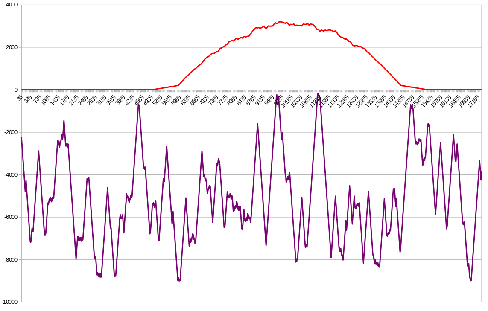

# pv-simulator

[](LICENSE)

Solves the PV Simulator Challenge

This application is divided into two services that communicate via a RabbitMQ message queue.

* The first service, `meter.py`, produces random but continuous power values. It generates 17280 values, which is equivalent to one value every 5 seconds for a whole day.

* The second service, `simulator.py`, consumes the values from the first service and generates power values that approximate the power output of a photovoltaic plant. These meter values, the pv values and their respective sum is then logged to a file.

## Setup

First make sure you have python 3, pip and pipenv installed. On Ubuntu, you can run

```shell
sudo apt update
sudo apt install python3-pip
pip install --user pipenv
```

Then install the required dependencies:

```shell
pipenv sync
```

You'll also need RabbitMQ installed and running, [follow these instructions](https://www.rabbitmq.com/download.html).

## Usage

The first service can be started by running `./meter.py`; it terminates automatically after a moment. By default, this generates power values between 0 and 9000. Run `./meter.py --help` to see all available options.

The second service can be started by running `./simulator.py`; it must be terminated by pressing <kbd>Ctrl+C</kbd>. By default, this generates photovolataic power values up to 3.5 kW, with some added noise to account for clouds and bad weather, and writes them to the file `pv_values.txt`. Run `./simulator.py --help` to see all available options.

### Randomness

Both services use a seed to generate randomness. This means that the results are perfectly reproducible by using the same seed.

## Example output


